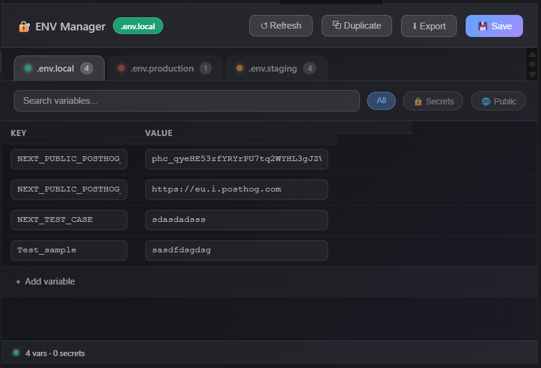
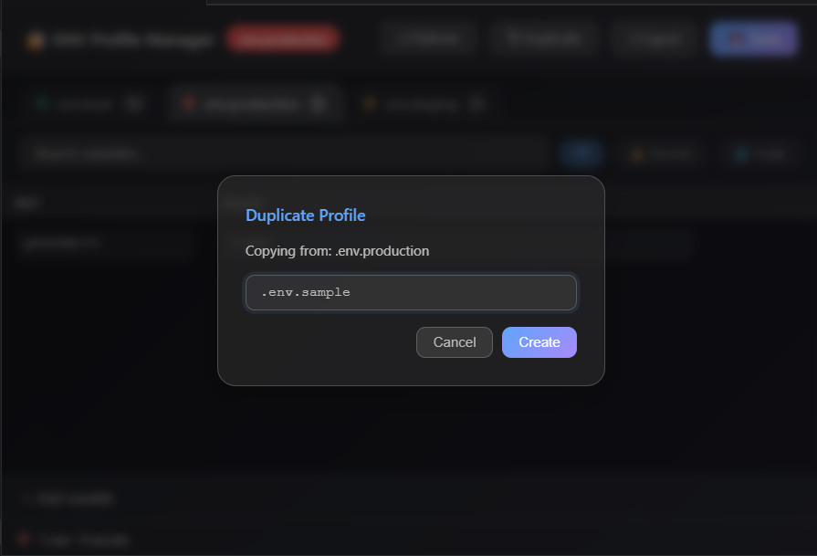
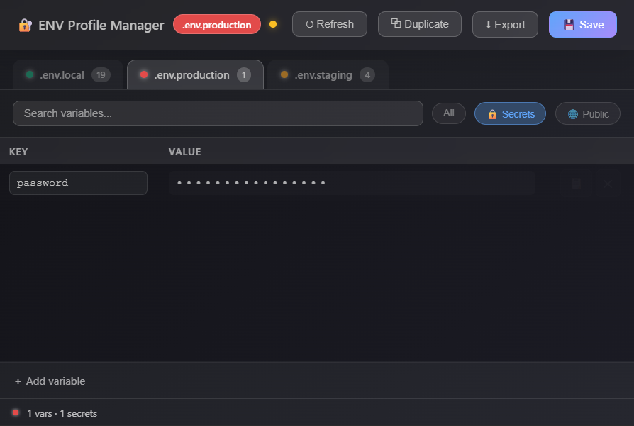
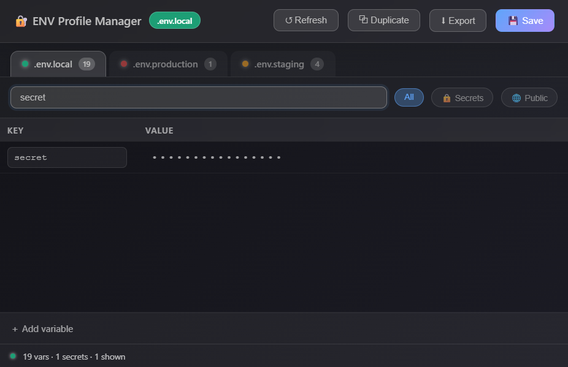

# 🔐 ENV Manager

> A modern visual editor for `.env` files in Visual Studio Code and Open VSX compatible editors. Easily switch between environment profiles, safely manage secrets, and edit variables without leaving your editor.

[](https://marketplace.visualstudio.com/items?itemName=GauravPrajapati.env-profile-manager)
[](https://marketplace.visualstudio.com/items?itemName=GauravPrajapati.env-profile-manager)
[](https://marketplace.visualstudio.com/items?itemName=GauravPrajapati.env-profile-manager)
[](https://open-vsx.org/extension/GauravPrajapati/env-profile-manager)
[](https://open-vsx.org/extension/GauravPrajapati/env-profile-manager)
[](LICENSE)

---

# 🚀 Why ENV Manager?

Managing multiple `.env` files manually is slow and error-prone.

ENV Manager gives you a clean visual interface to:

* 🔄 Switch between environment profiles instantly
* 🔒 Keep secrets hidden by default
* ✏️ Edit variables without opening raw files
* 🔍 Search and filter variables in seconds
* 📦 Generate `.env.example` files with one click

Everything happens locally inside your editor.

---

# ✨ Features

### 📁 Multi-Profile Support

Quickly switch between:

* `.env`
* `.env.local`
* `.env.development`
* `.env.production`
* `.env.staging`
* Any custom `.env.*` profile

---

### 🔒 Secret Masking

Protect sensitive information.

* API Keys
* Passwords
* Tokens
* Secrets

Values stay hidden by default and can be revealed when needed.

---

### ✏️ Visual Editing

Update variables through a clean interface.

* Add variables
* Edit values
* Remove entries

No manual editing required.

---

### 🔍 Search & Filter

Instantly find variables by:

* Name
* Value
* Secret variables
* Public variables

---

### ⬇️ Export `.env.example`

Generate a safe `.env.example` file containing only variable names without exposing sensitive values.

---

### 💾 Save in Place

Changes are saved directly back to your selected `.env` file.

---

# 📸 Screenshots

> Replace these placeholders with actual screenshots or animated GIFs.

## Main Interface



## Profile Switching



## Secret Masking



## Search & Filter



---

# 📦 Installation

## Visual Studio Code Marketplace

Install directly from the Visual Studio Marketplace:

👉 https://marketplace.visualstudio.com/items?itemName=GauravPrajapati.env-profile-manager

Or:

1. Open **Extensions** (`Ctrl + Shift + X`)
2. Search for **ENV Manager**
3. Click **Install**

---

## Open VSX Registry

For **VSCodium**, **Cursor**, **Windsurf**, **Eclipse Theia**, and other Open VSX-compatible editors:

👉 https://open-vsx.org/extension/GauravPrajapati/env-profile-manager

Or:

1. Open the **Extensions** panel.
2. Search for **ENV Manager**.
3. Click **Install**.

---

# 🚀 Getting Started

Open ENV Manager using either method:

### Command Palette

```
Ctrl + Shift + P
```

Run:

```
ENV Profile Manager: Open
```

---

# 💻 Perfect For

ENV Manager works great with projects built using:

* React
* Next.js
* Vue
* Angular
* Vite
* Svelte
* Node.js
* Express
* NestJS
* Django
* Laravel
* Astro
* Remix
* Any project using `.env` files

---

# 🛣️ Roadmap

Upcoming features:

* [ ] Profile comparison (Diff View)
* [ ] Duplicate environment profiles
* [ ] Variable validation
* [ ] Import & Export profiles
* [ ] GitHub Gist Sync
* [ ] Workspace Templates
* [ ] Encrypted profiles
* [ ] Profile backup & restore

---

# ❓ Frequently Asked Questions

### Does ENV Manager upload my environment variables?

No.

Everything stays on your computer.

No environment variables are uploaded or stored on external servers.

---

### Does it edit my `.env` file?

Yes.

Changes are saved directly to the selected `.env` file.

---

### Is my data secure?

Yes.

ENV Manager works locally and does not transmit your secrets.

---

### Is it open source?

Yes.

Bug reports, feature requests, and pull requests are always welcome.

---

# 🤝 Contributing

Found a bug or have an idea?

* 🐞 Report bugs
* 💡 Suggest features
* 🚀 Submit pull requests

## GitHub Repository

https://github.com/gauravprajapatidev/env-manager-extention

## Issue Tracker

https://github.com/gauravprajapatidev/env-manager-extention/issues

---

# ❤️ Support Development

If ENV Manager saves you time or improves your workflow, consider supporting its development.

Your support helps fund:

* 🚀 New features
* 🐛 Faster bug fixes
* 📚 Better documentation
* 🔧 Long-term maintenance

<a href="https://ko-fi.com/gauravprajapati">
    
</a>

Or visit:

**https://ko-fi.com/gauravprajapati**

Every contribution, no matter the size, helps keep the project active.

Thank you for your support! ☕

---

# ⭐ Enjoying ENV Manager?

If you like this extension, please consider:

* ⭐ Star the GitHub repository
* 💙 Leave a review on the VS Code Marketplace
* 🚀 Recommend it to your team
* ☕ Support development on Ko-fi

Your support helps make ENV Manager even better.

---

# 📄 License

MIT License © Gaurav Prajapati
